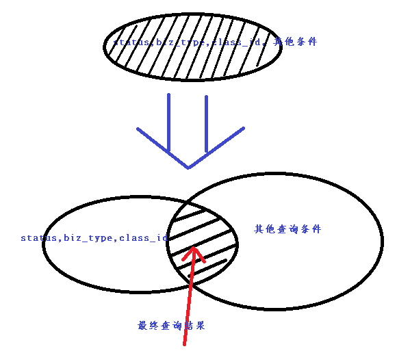

## 什么是filtercache？

solr应用中为了提高查询速度有可以利用几种cache来优化查询速度，分别是fieldValueCache，queryResultCache，documentCache，filtercache，在日常使用中最为立竿见影，最有效的应属filtercache，何谓filtercache？这个需要从一段solr的查询日志开始说起，下面是我截取的solr运行中打印的一段查询日志：
```shell script
[search4alive-0] Request_is ==> q=status%3A0++AND+biz_type%3A2+AND+class_id%3A1&sort=index_sort_order+desc&start=0&rows=5,queryTime_is ==> 2                                      
[search4alive-0] Request_is ==> q=status%3A0++AND+biz_type%3A1+AND+class_id%3A1+AND+%28group_id%3A411%29&sort=gmt_create+desc&start=0&rows=20,queryTime_is ==> 2                  
[search4alive-0] Request_is ==> q=status%3A0++AND+biz_type%3A2+AND+class_id%3A1&sort=index_sort_order+desc&start=0&rows=5,queryTime_is ==> 2                                      
[search4alive-0] Request_is ==> q=status%3A0++AND+biz_type%3A1+AND+class_id%3A1+AND+%28group_id%3A8059%29&sort=gmt_create+desc&start=0&rows=20,queryTime_is ==> 0                 
[search4alive-0] Request_is ==> debugQuery=on&group=true&group.field=group_id&group.ngroups=true&group.sort=gmt_create+desc&q=status%3A0++AND+biz_type%3A1+AND+class_id%3A1+AND+ha
[search4alive-0] Request_is ==> q=status%3A0++AND+biz_type%3A2+AND+class_id%3A1&sort=index_sort_order+desc&start=30&rows=30,queryTime_is ==> 4                                    
[search4alive-0] Request_is ==> q=status%3A0++AND+biz_type%3A2+AND+class_id%3A1&sort=index_sort_order+desc&start=0&rows=5,queryTime_is ==> 1                                      
[search4alive-0] Request_is ==> q=status%3A0++AND+biz_type%3A1+AND+class_id%3A1+AND+%28group_id%3A375%29&sort=gmt_create+desc&start=0&rows=20,queryTime_is ==> 3                  
[search4alive-0] Request_is ==> q=status%3A0++AND+biz_type%3A2+AND+class_id%3A1&sort=index_sort_order+desc&start=0&rows=5,queryTime_is ==> 1                                      
[search4alive-0] Request_is ==> q=status%3A0++AND+biz_type%3A2+AND+class_id%3A1&sort=index_sort_order+desc&start=0&rows=30,queryTime_is ==> 4                                     
[search4alive-0] Request_is ==> q=status%3A0++AND+biz_type%3A2+AND+class_id%3A1&sort=index_sort_order+desc&start=0&rows=5,queryTime_is ==> 1                                      
[search4alive-0] Request_is ==> q=status%3A0++AND+biz_type%3A2+AND+class_id%3A1&sort=index_sort_order+desc&start=0&rows=30,queryTime_is ==> 4                                     
[search4alive-0] Request_is ==> q=status%3A0++AND+biz_type%3A2+AND+class_id%3A1&sort=index_sort_order+desc&start=0&rows=30,queryTime_is ==> 3                                     
```

看到这段查询日志之后，我们开始考虑如何提升查询的rt（查询速度），因为在参数q中的查询是要有磁盘IO开销的，很自然的思路是将整个查询的参数q作为key，对应的结果作为value，这样做是可以的，但是查询的命中率会很低，会占用大量内存空间。

查询`参数q`上每次都会出现status,biz_type,class_id 对于这样的字查询，所以可以把整个查询条件分成两部分，一部分是以status,biz_type,class_id 这几个条件组成的子查询条件，另外一部分是除这三个条件之外的子查询。在进程查询的时候，先将status,biz_type,class_id 条件组成的条件作为key，对应的结果作为value进行缓存，然后和另外一部分查询的结果进行求交运算。


通过上面这幅图明白了filtercache的意义是，将原先一个普通查询分割成两个组合查询的与运算，两个子查询至少有一个使用缓存，这样既减少了查询过程的IO操作，又控制了缓存的容量不会消耗过多的内存。

## 如何使用？

### 配置solrconfig.xml 要开启fltercache：
```xml
<query>  
    <filterCache  class="solr.LRUCache"   size="50000"  initialSize="512"      autowarmCount="0"/>  
</query>
```
### 客户端API调用

原客户端查询代码：
```java
SolrQuery query = new SolrQuery();
query.setQuery("status:0 AND biz_type:1 AND class_id:1 AND xxx:123");  
QueryResponse response = qyeryServer.query(query);  
```
使用filterQuery之后的查询代码：
```java
 SolrQuery query = new SolrQuery();
 query.addFilterQuery("status:0 AND biz_type:1 AND class_id:1");  
 query.setQuery("xxx:123");
 QueryResponse response = qyeryServer.query(query); 
```
将部分setQuery()方法中设置的条件，转移到addFilterQuery()方法中，经过测试这样优化之后，查询响应时间会明显减小，QPS会有明显提升。

## 使用filterquery过程中需要注意点

### 不能在filterQuery 上重复出现query中的查询参数，如下所示
```java
query.addFilterQuery("status:0 AND biz_type:1 AND class_id:1 AND xxx:123");
query.setQuery("xxx:123");
```
 如上，条件xxx:123 在filterQuery和query上都出现了，这样的写法非但起不到查询优化的目的，而且还会增加查询的性能开销。

### 尽量减少调用addFilterQuery方法的次数

```java
query.addFilterQuery("status:0 ");
query.addFilterQuery("biz_type:1 ");
query.addFilterQuery("class_id:1 ");
query.setQuery("xxx:123");
```
如上，将`status:0 AND biz_type:1 AND class_id:1` 这个组合查询条件，分三次调用filterQuery方法来完成，这样的调用方法虽然是正确的，并且能起到性能优化的效果，优化性能没有调用一次addFilterQuery方法来得高，原因是多调用了两次addFilterQuery，就意味着最后需要多进行两次结果集的求交运算，虽然结果集求交运算速度很快，但毕竟是有性能损耗的。

## 总结

在Solr的几种cache中filterCache是经常被用到，而且能起到立竿见影的效果。通过filterQuery的查询条件是不参与文档相关性打分公式Socre计算的，这可以更进一步降低查询时系统开销。

不过filterCache在在具体应该时收到会收到solr默认的softCommit策略影响，如果softCommit提交过于频繁(经常会要求1秒进行一次softcommit)，会导致filterCache几乎起不到缓存的目的。正确的姿势应该是，在业务方允许的前提下，尽量延长softCommit提交的频率。


