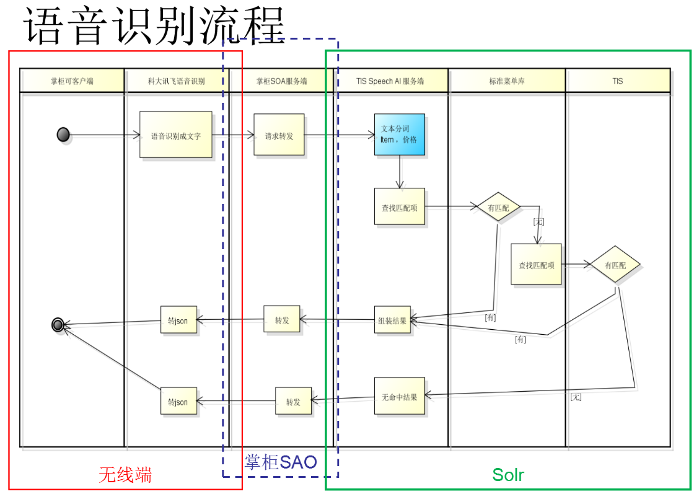

## 前言
曾几何时我们对搜索引擎的认识只是百度、谷歌、或淘宝网站上首页显著位置上的那个搜索框，认为那就是搜索引擎的全部。
随着大数据时代的到来，搜索引擎作为底层数据处理中间件，通过倒排索引能够快速在海量数据中个性化精准筛选出目标数据，且能对目标数据进行个性化排序，因此被赋予了多个使用场景。

比如，搜索技术和最近很火的人工智能AI技术相结合，通过上层的MashUp可以构建出很多有意思且在生产环境中能大幅提高生产效率的应用。

本文就向大家介绍在一家公司供应链和掌柜端业务中，利用开源搜索引擎框架Solr和科大讯飞语音识别技术MashUp构建的“原料采购语音助手”应用。

## 功能介绍
进入无线时代原先大量的在PC上使用的功能会转到无线端上来，一家公司服务的B端商家尤为明显。餐饮企业的管理者很少有从早到晚坐在办公室中，都需要在餐厅和厨房间来回跑，所以大量的业务操作都需要在手机上完成，但是手机比PC比起来在完成复杂的业务操作有一定的劣势，那就是屏幕太小且没有键盘和鼠标的辅助手段，会对用户形成一定的障碍。
但是随着AI技术的普及，特别各云平台厂商（比如百度，华为，阿里等）提供了PAAS的AI服务，可以让众多小企业可以快速MashUp出智能产品。

### 基于搜索的语音助手
一家公司供应链产品中商家每天需要对店铺中的库存原料进行盘点，库存不足的原料需要及时补货，补货是每天都需要做的。创建一条采购单需要用户输入原料名称及数量和单位，“一斤”“一包”还是“一袋”。完成这一流程需要用户在手机上作大量的输入操作，这使得用户非常挠头。
如何提高工作效率，我们很自然地想到了语音，让用户对着手机说，比如“色拉油采购一箱”即可完成一条原料采购。

用户操作流程如下图：

<table>
 <tr>
  <td>
  1. 用户进入采购功能界面，左下角会出现一个语音输入的小话筒（语音输入的流程是可选的，因为现在还无法做到100%的高识别率，如碰到语音无法识别的情况，用户可以选择之前的操作流程） 
  2. 点击页面下方的“小话筒”用户即可对着手机说话（页面会告知用户的表达范式） 
  3. 说完之后放开“小话筒”按钮，系统就会识别用户的语音内容，如未识别出则可以继续重复前面的步骤 
  </td>
  <td>
  
  </td>
 </tr>
</table>

## 功能实现
经过一番可行性分析之后，实现这个功能大致框架如下:


产品主要包括三部分模块：
1. 无线端，用户界面交互以及调用科大讯飞API完成语音识别
2. 掌柜SOA服务端，实现组装分发请求
3. 搜索引擎（Solr），主要做原料匹配数量识别及单位识别

这里我们暂且不讨论无线端的UI设计，重点讨论一下后端如何实现。

如果把语音助手功能当作一个黑盒，那它主要功能就是，输入一段语音，然后输出一个数据结构。数据结构由三部分构成，系统中的一条原料的ID，和采购的单位及数量，如下图所示

该过程中关键点包括：
1. 将语音流转换成字符

    各大云平台都提供了基于PAAS的语音识别产品。经过一番考察，科大讯飞的语音识别产品最符合我们的需要（https://console.xfyun.cn），其中的语音听写服务，识别准确率比较高。它的语音识别不针对任何垂直领域，所以在像一家公司这样专注餐饮领域场景下的语音识别会存在同音词的情况，但这有办法去矫正的，比如在科大讯飞的产品页面可以上传高频词文本，可以提高识别的准确率。 

2. 处理字符串

    通过科大讯飞的语音识别，得到了一段字符串文本。字符串处理的主要工作包括两部分：
    1. 就是要解析出原料实体部分，并且和系统中的现有原料进行匹配，得到现有系统中的原料ID，这一步会用到Solr，具体处理会有不少细节问题，后面会详细介绍。
    2. 解析字符串中数量部分，因为科大讯飞语音识别对数字部分的解析结果会有多种样式，有阿拉伯数字，有中文汉子样式所以在数量解析过程中需要作归一化处理。
    3. 解析字符串中数量的单位部分
    
## 字符串解析细节实现
### 原料名称同音词问题
用户口述的原料名称虽然能被科大讯飞识别出来，但是和供应链中的库存中的原料名称可能是无法匹配的，例如以下几个例子：
右边的是系统中的原料名称，左边是识别得到的结果：
1. 素鸡      =>素几 
2. 小谷肉相连 =>小骨肉相连 
3. 世纪到     =>四季豆
4. 西子花哈   =>锡纸花蛤

针对同音词问题，在Solr查询过程中可以尝试多次匹配的方法，就以”西子花蛤”为例对系统中已有的数据尝试进行三次查询，日志如下列表：

1. index:0,match:0,q=entity_id: 00999999 AND is_valid:1 AND {!terms f=name}`西子花蛤`AND ( ((goods_type:1 AND self_entity_ids: 00999999) OR (goods_type:2 AND self_entity_id:00256313)))&rows=20&fl=id,name,bar_code&single.slice.query=true&distrib=false&_route_=10033910&_stateVer_=search4supplyGoods:489
2. index:1,match:0,q=entity_id:00999999 AND is_valid:1 AND {!terms f=name}`xizihuaha` AND ( ((goods_type:1 AND self_entity_ids: 00999999) OR (goods_type:2 AND self_entity_id:00256313)))&rows=20&fl=id,name,bar_code&single.slice.query=true&distrib=false&_route_=10033910&_stateVer_=search4supplyGoods:489
3. index:2,match:1,q=entity_id:00999999 AND is_valid:1 AND {!terms f=name}`xzhh` AND ( ((goods_type:1 AND self_entity_ids:00999999) OR (goods_type:2 AND self_entity_id:00256313)))&rows=20&fl=id,name,bar_code&single.slice.query=true&distrib=false&_route_=10033910&_stateVer_=search4supplyGoods:489

以上是对Solr进行的三次匹配的查询日志：
第一次使用识别字符”西子花蛤”进行匹配，很明显这不会命中。
然后，进行第二次匹配，将”西子花蛤” 转换成拼音全拼”xizihuage”进行匹配，这次也有可能匹配不到。
最后将”西子花蛤”的拼音每个字的首字母提取”zzhg”进行匹配。

进行三次尝试之后依然可能会命中不到记录，那就需要告知用户无法识别，进行下一次尝试。
每次尝试的查询其实是在不断降维，第一次查询命中范围最小，但结果可信度较高。后面两次查询放宽了范围，命中结果会逐渐增多，需要流程上添加让用户在命中结果上进行选择的操作。

为了让Solr能够支持汉字模糊匹配，与拼音全拼与声母的模糊匹配需要在Solr的Schema配置文件中配置`FieldType`，示例如下：


FieldType中定义的内容是，通过tokenizer生成的Term集合流依次通过filter（上图红色部分是经过特殊定制过的filter）管道中处理最后生成”西子花蛤”对应的语汇单元集合，具体执行流程如下图：

如上，”西子花蛤”字串在通过这一系列filter处理之后会生成一大堆Term集合，数据量增长了好多，底层Lucene将这些Term保存在一个倒排链表中通过特有的数据压缩和存储方式，可以让用户高效地检索数据。
### 数量规格的多样性
解析字符串中数量部分，科大讯飞语音识别对数字部分的解析结果会有多种样式，有阿拉伯数字，有中文汉子样式所以在数量解析过程中需要作归一化处理。比如：“牛肉一斤”  “牛肉两斤” “牛肉300克10包”，比如表达数量2，可以说“er”也可以说“liang”，以下是单位数量解析执行流程图：

流程中使用了IK分词器[https://github.com/hutu92/IKAnalyzer2017_6_6_0](https://github.com/hutu92/IKAnalyzer2017_6_6_0)，
IK在分词过程中会将每个分词标注一个词性（这非常棒！），可依赖词性来判断字串的属性进行相应的处理，从而可以对数量进行归一化处理。

## 为什么选择Solr
当有这个问题的时候，其实潜台词是除了**Solr**还有其他选择，比如现在非常火的**ElasticSearch**，以下是我个人观点为什么使用**Solr**：

1. ES和Solr都是构建于Lucene之上的解决分布式Cloud集群搜索的解决方案，在解决Cloud扩容水平垂直扩容，查询的负载均衡方面ES和Solr实现方式大同小异。且Solr和Lucene都是隶属于Apache官网的子项目，每次Lucene有新的版本发布时候，同时Solr也会第一时间发布新的版本，Lucene新版本中的优化、新的功能都会第一时间在Solr新版本中体现。
ES现在比较火的原因是ELK在解决日志分析这个领域提供了开箱即用的产品，但这只是搜索引擎在众多使用场景中的一个场景。抛开日志分析这个垂直领域，ES和Solr其实是在同一起跑线上的。

2. 另外使用Solr属于个人偏好，从2011年起就一直从事基于Solr的搜索平台化相关的工作，熟悉Solr中的各种扩展机制，对于生产线上的各种普通或者变态的搜索需求能够利用Solr来解决，用起来比较顺手。

## 继续优化方向
目前这套系统的语音识别准确率可以达到90%，不过生产环境中还是会有一些case无法识别，比如音相近但不是同声母，例如：识别结果为“最长30”，但是用户实际要表达的是“脆肠30”，这种case下使用拼音也无法匹配到目标原料记录。
优化方法可以在后台系统中不断积累用户的语音记录，然后通过人工打标，通过tensorflow框架不断地去训练自己的语音识别模型，从而逐步提高语音识别的准确率。
