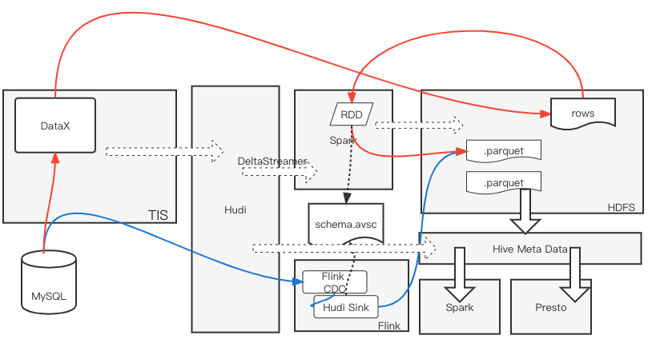

## 拥抱数据湖

随着大数据时代的到来，数据量动辄PB级，因此亟需一种低成本、高稳定性的实时数仓解决方案来支持海量数据的OLAP查询需求，[Apache Hudi](https://hudi.apache.org/) 应运而生。

Hudi借助与存放在廉价的分布式文件系统之中列式存储文件，并将其元数据信息存放在Hive元数据库中与传统查询引擎Hive、Presto、Spark等整合，完美地实现了计算与存储的分离。Hudi数据湖方案比传统的Hive数仓的优势是加入了数据实时同步功能，
可以通过最新的Flink流计算引擎来以最小的成实现数据实时同步。

本质来说Hudi是整合现有的技术方案实现的，属于新瓶装旧酒，Hudi内部需要整合各种组件（存储、Indexer、Compaction，文件分区），为了达到通用及灵活性，每个组件会有大量的配置参数需要设置，且各种组件
的配置是有关联性的，所以对与新手来说要构建一个生产环境中可用的数据库方案，面对一大堆配置往往会望而却步。

本文就向大家介绍如何通过TIS来改善Hudi数据湖实例构建流程，从而大幅提高工作效率。

## TIS可以为您做什么？

TIS将Hudi中的各组件进行优雅地封装，并且基于TIS的数据字典组件自动生成[Hudi DeltaStreamer](https://hudi.apache.org/docs/next/hoodie_deltastreamer#deltastreamer) 及 [Flink Stream API](https://github.com/apache/hudi/blob/master/hudi-flink-datasource/hudi-flink/src/main/java/org/apache/hudi/streamer/HoodieFlinkStreamer.java)运行所需要
配置，**Hudi数据表相关的配置都是在TIS的UI界面上完成操作，实现了轻点鼠标完成构建流程，实现开箱即用从而大幅提高构建Hudi数据湖的效率**。

TIS采用两种方式实现数据入湖：
1. `DeltaStreamer`: 该方法实现批量数据导入，通过DataX将数据表中数据以avro格式导入到HDFS中，之后启动DeltaStreamer通过Spark RDD消费HDFS中的原始数据进行数据入湖。
    该种方式适合历史数据导入，优点是速度快吞吐率大。不足是无法提供Hudi表增量同步功能。
2. 基于[Flink Stream API](https://github.com/apache/hudi/blob/master/hudi-flink-datasource/hudi-flink/src/main/java/org/apache/hudi/streamer/HoodieFlinkStreamer.java)方式
（Stream SQL不推荐，**原因是，使用Stream API的方式可以和DeltaStreamer执行流程中都依赖同一份Avro Schema来定义Hudi表结构，这样就保证Hudi表数据结构统一**）：基于Flink Stream API的方式来实现增量数据同步功能，
优点是可以保证数据源和Hudi表保证低延时同步（一个CheckPoint周期之内），缺点是，当利用该种方式结合[Flink CDC]()组件来导入历史全量数据时由于触发CheckPoint执行过程种需要将历史数据写入到Flink Statebackend种存储，由于数据量大往往会导致Flink CheckPoint执行超时
导致Flink Job执行失败，另外，由于Flink Job执行过程种还会触发Hudi Compaction操作由于数据量大也会导致Flink Job产生OOM异常从而任务失败。

推荐用户在实际生产环境中将以上**两种方式结合使用**，初次构建Hudi，数据湖表需要导入历史全量数据，这时采用第一种`DeltaStreamer`批量导入历史全量数据。等待构建完成，继续开启Flink增量同步任务（以[Flink CDC MySQL Connector](https://github.com/ververica/flink-cdc-connectors/tree/master/flink-connector-mysql-cdc)为例，消费游标使用`Latest`策略消费，消费最新Binlog增量数据）
这样就可以规避Flink Job由于读取全量历史数据因数据量大导致的Job失败的故障产生。

## 实现原理
实现原理如下图所示：


通过在TIS平台中定义Hudi数据湖实例，可以选择由DeltaStreamer来执行数据批量导入Hudi表，或者由Flink Job来执行增量Hudi表数据同步任务。

## 如何安装

TIS的安装非常方便，只需三个步骤：下载一个tar压缩包，解压，最后启动即可。详细请查看 [<i class="fa fa-download" aria-hidden="true"></i>TIS安装说明]()

>TIS是基于微内核架构来实现的，初始安装包只有200兆，其他具体执行逻辑相关的执行逻辑都封装在了TIS的插件系统中，
本文相关的Hudi和MySQL以及Flink增量同步、DataX批量同步相关的功能插件都是在TIS运行时按需加载并热部署生效的。

## 视频教程

<iframe style="width:500px;height:400px" src="http://player.bilibili.com/player.html?aid=299600503&bvid=BV1FF411L7Wh&cid=734887823&page=1" 
scrolling="no" border="0" frameborder="no" framespacing="0" allowfullscreen="true"> </iframe>

## 依赖版本

本示例依赖如下组件版本：

 | 组件名称| 版本    |
 | -------- | -----  |
 | Apache Hudi     | 0.10.1 |
 | Apache Spark   |  spark-2.4.4-bin-hadoop2.7 |
 | Apache Hive     | 2.1.1 以上  |
 | Apache Hadoop  | 2.7.3 | 
 | Apache Flink  | tis-1.13.1(基于Flink 1.13.1 定制，解决不同组件Source，Sink之间可能存在的三方依赖包冲突) |

## 创建MySQL到Hudi千表入湖通道


### 准备工作

1. 准备一个MySQL测试数据库，版本5.7
2. 下载Hudi [Source包](https://www.apache.org/dyn/closer.lua/hudi/0.10.1/hudi-0.10.1.src.tgz) 运行环境（使用Hudi0.10.1）：为了简化演示，在Hudi安装包中一个一个Hudi [docker compose](https://www.cnblogs.com/yang-qiu/p/15726821.html)启动脚本，本说明中就用该执行脚本来创建Hudi运行环境
    详细请查看[https://hudi.apache.org/docs/next/docker_demo](https://hudi.apache.org/docs/next/docker_demo) 完成Hudi Docker运行环境安装
  
    启动docker-compose之前需要修改docker-compose的配置文件（./hudi-release-0.10.1/docker/compose/docker-compose_hadoop284_hive233_spark244.yml），在docker镜像实例`sparkmaster`与`spark-worker-1`上添加一个hosts配置文件可以避免
    DeltatStreamer执行过程中提交任务端Hostname不能识别的错误：

    <table>
    <thead>
     <tr>
     <th>添加项
     </th>
       <th>
       添加后效果
        </th>
     </tr>
     </thead>
     <tr>
      <td>
      
         ``` yaml
          extra_hosts:
            - "baisui-test-1:192.168.28.200"
          
          ``` 
      </td><td>
       
       ``` yaml       
       sparkmaster:
           image: apachehudi/hudi-hadoop_2.8.4-hive_2.3.3-sparkmaster_2.4.4:latest
           hostname: sparkmaster
           container_name: sparkmaster
           env_file:
             - ./hadoop.env
           ports:
             - "8080:8080"
             - "7077:7077"
           extra_hosts:
             - "baisui-test-1:192.168.28.200"
           environment:
             - INIT_DAEMON_STEP=setup_spark
           links:
             - "hivemetastore"
             - "hiveserver"
             - "hive-metastore-postgresql"
             - "namenode"
       
         spark-worker-1:
           image: apachehudi/hudi-hadoop_2.8.4-hive_2.3.3-sparkworker_2.4.4:latest
           hostname: spark-worker-1
           container_name: spark-worker-1
           env_file:
             - ./hadoop.env
           depends_on:
             - sparkmaster
           ports:
             - "8081:8081"
           extra_hosts:
             - "baisui-test-1:192.168.28.200"
           environment:
             - "SPARK_MASTER=spark://sparkmaster:7077"
           links:
             - "hivemetastore"
             - "hiveserver"
             - "hive-metastore-postgresql"
             - "namenode"
         ```    
      </td>
     </tr>
    </table>
  
    然后就可以启动Hudi docker-compose了
    
    ```shell script
   # 启动 
   sh hudi-0.10.1/docker/setup_demo.sh
   # 停止
   sh hudi-0.10.1/docker/stop_demo.sh 
    ```

3. 安装[tis-flink](http://tis.pub/docs/install/flink-cluster/standalone/)
4. [安装单机版tis](http://tis.pub/docs/install/uber/)

### 基本信息配置
|说明  | 图示    |
| --- | ------- |
|当完成**安装**步骤之后，进入TIS操作界面，点击菜单栏中`实例`链接||
|进入实例列表，点击右侧`添加`下拉按钮中的`数据管道`，进行MySQL端到Hudi端的数据同步通道构建 | |
|添加流程一共分为5步，第1步添加数据通道的基本信息||
|进入数据端选择步骤，选择**Reader** **Writer**类型选择，由于系统刚安装，数据端类型对应的插件还没有选取，需要点击插件安装`添加`按钮，安装插件 | |
|从插件列表中选择`tis-ds-mysql-plugin`,`tis-datax-hudi-plugin`两个插件进行安装 |  |
|插件安装完毕，将`插件管理`页面关闭 ||
|Reader端选择`MySQL`,Writer端选择`Hudi`，点击`下一步`按钮，进行MySQL Reader的设置 | |
|在Reader设置页面，点击`数据库名`项右侧`配置`下拉框中**MySqlV5** 数据源，完成表单填写，点击`保存`按钮，其他输入项目使用默认值即可，然后再点击`下一步`选取Reader端中需要处理的表||
|选择需要的表: <br><br>点击`设置`按钮，对目标Hudi表设置，设置目标表的**目标列**、**分区**、**主键**等属性设置.<br><br> 点击`保存`按钮，然后点击下一步，进入Hudi Writer表单设置| |
|Hudi Writer表单<br><br>1. 点击`sparkConn`项右侧`管理`下拉框中**添加**按钮，添加SparkMaster源。<br><br>2. 点击`hiveConn`项右侧 `数据源管理`下拉框`添加`按钮，添加hiveConn源<br><br> 3. 点击`fsName`项右侧 `FS管理` 下拉框`添加`按钮，添加分布式文件系统源<br><br> 4.其他选项按照说明设置录入||
|确认页面，对上几步流程中录入的信息进行确认。对DataX脚本和目标库建表DDL进行确认。<br><br>点击`创建`按钮完成数据流通道定义||

### 批量数据导入
|说明  | 图示    |
| --- | ------- |
|Hudi数据通道定义完成，开始批量导入MySQL中全量历史数据<br><br>由于TIS系统初次安装，还未安装触发器插件，请按照只是先安装，成功之后再触发**批量导入**||

### Flink增量同步开通
|说明  | 图示    |
| --- | ------- |
|接下来开通实时增量通道<br><br>首先需要安装**Flink单机版** [安装说明]()| |
|Flink集群启动之后，在TIS中添加Flink集群对应配置,请妥善设置Flink相关的`重启策略`、`checkpoint`、`stateBackend`相关属性<br></br>表单填写完成之后，点击`保存&下一步`按钮进入下一步Sink，Source相关属性设置||
|在该步骤添加Flink SourceFunction对应的[flink-connector-mysql-cdc](https://github.com/ververica/flink-cdc-connectors/tree/master/flink-connector-mysql-cdc)插件 和 Fink Sink对应的Hudi 插件<br><br>设置完成之后进入下一步||
|TIS会解析Reader选取的表元数据信息，自动生成Flink Stream Code<br><br>在该版本中，自动生成的Flink Stream Code还不支持用户自定义编写业务逻辑  <br><br>点击`部署`按钮，进入向Flink Cluster中部署流处理逻辑<br><br>等待片刻，跳转到创建成功的页面||
|至此，MySQL与Hudi表增量通道已经添加完成，MySQL到Hudi表实时数据同步可以保证在一个Checkpoint周期内完成|


## 总结
通过以上流程介绍，我们发现通过使用[TIS](http://tis.pub)来实现MySQL与Hudi表同步有如下优势：
- 安装方便，组件按需加载，热生效
- 支持数据源分库，多表同步
- 完美实现低代码配置DataOps的目标，帮助用户大大提高工作效率，且避免出错

> 还等什么呢？赶快试用一下吧

## 后续
本次是TIS与数据湖产品Hudi的整合的初次尝试，Hudi的配置项比较繁杂，且各个配置项之间又存在各种依赖关系。

TIS对Hudi的封装过程中还没有将Hudi的所有配置项（例如：Indexer的配置相关）开放给用户配置，后续会陆续完善。

假如您TIS有功能需求，请在Github的Issue栏中添加：[https://github.com/qlangtech/tis/issues](https://github.com/qlangtech/tis/issues)

