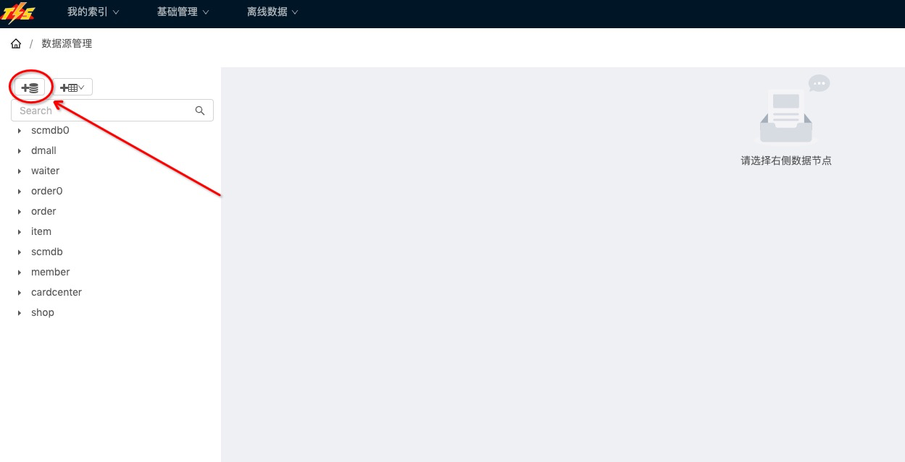
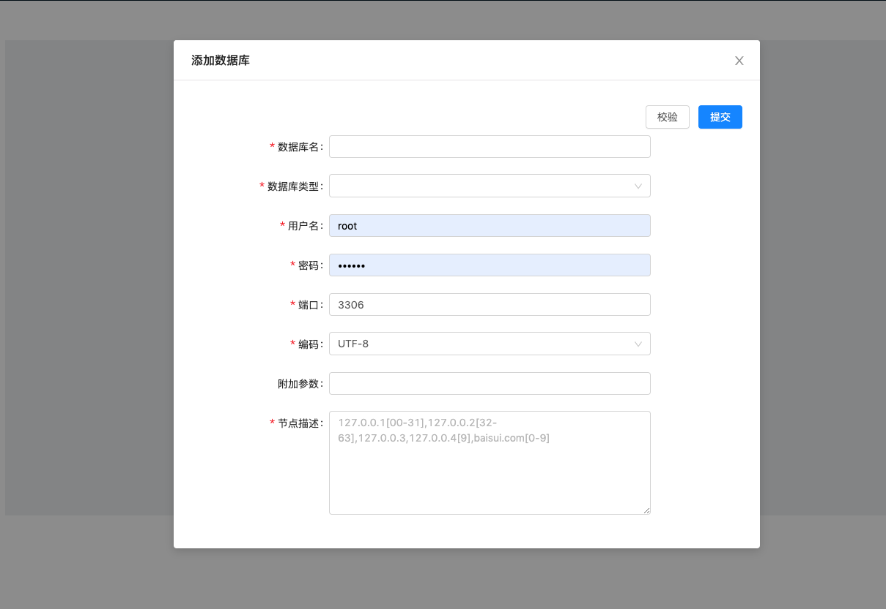
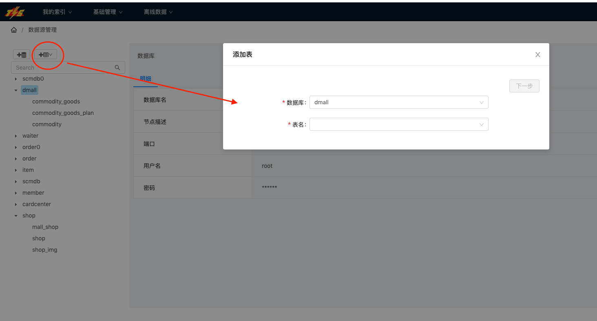
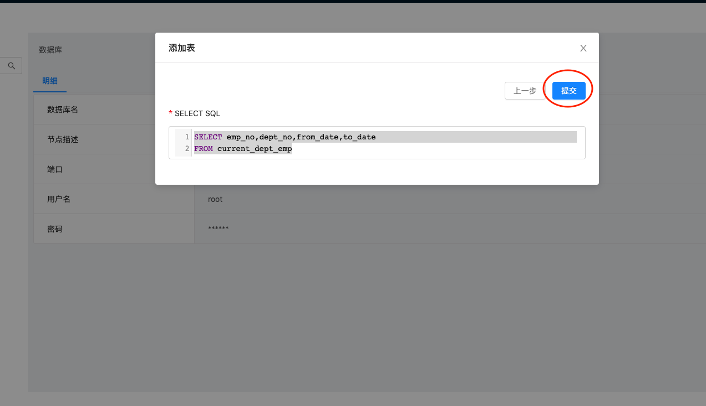
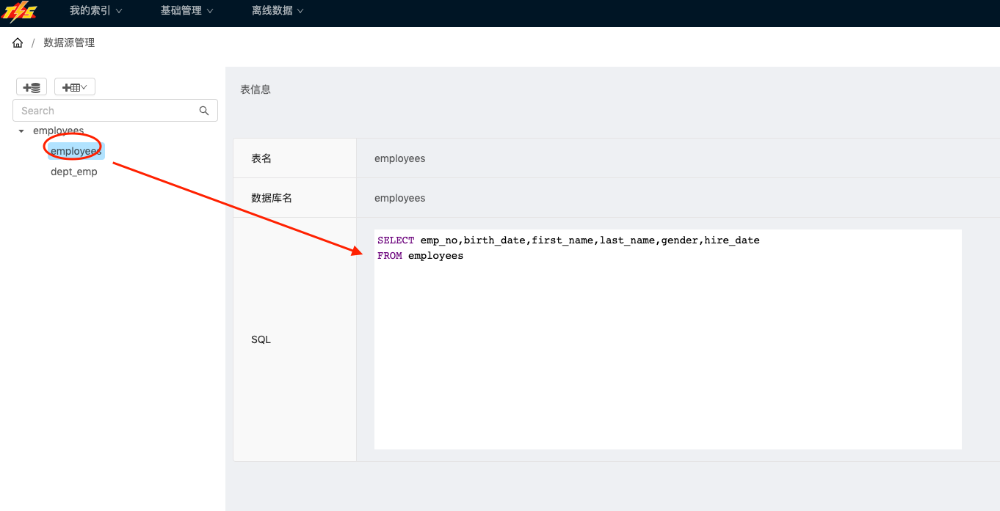

## 作用

TIS系统可以从关系数据源中抽取数据，经过加工之后导入到Solr中。 `数据源管理模块`承担了定义抽取数据源的责任，定义的信息可以在后期为全量构建，和增量同步流程中使用。

## 支持的数据类型

目前支持的数据源是mysql，将来会支持更多的关系型数据源。

## 定义数据库表

|||
|----|---|
| 打开链接数据源定义页面，`/offline/ds`， 并且 点击数据库定义页面|  |
| 录入数据库信息，在提交表单之前，可以点击**校验**按钮对表单填写的内容进行校验，  数据库是支持分库的，在`节点描述`属性中可以填写[分库规则]()| |
| 数据库配置添加完成之后，就可以添加`数据表`配置啦 通过`数据库`下拉框选择目标库 通过`表名`下拉框选择需要导入的数据表，点击**下一步**对抽取SQL进行确认 |  |
| 对抽取SQL进行确认，点击**提交**按钮完成数据表定义 ||
| 点击左边树状控件，点击已添加的`表定义节点`查看表配置 ||

## 总结

在下一步[数据流管理]()中需要依赖到的 表配置资源，需要在此定义完成

